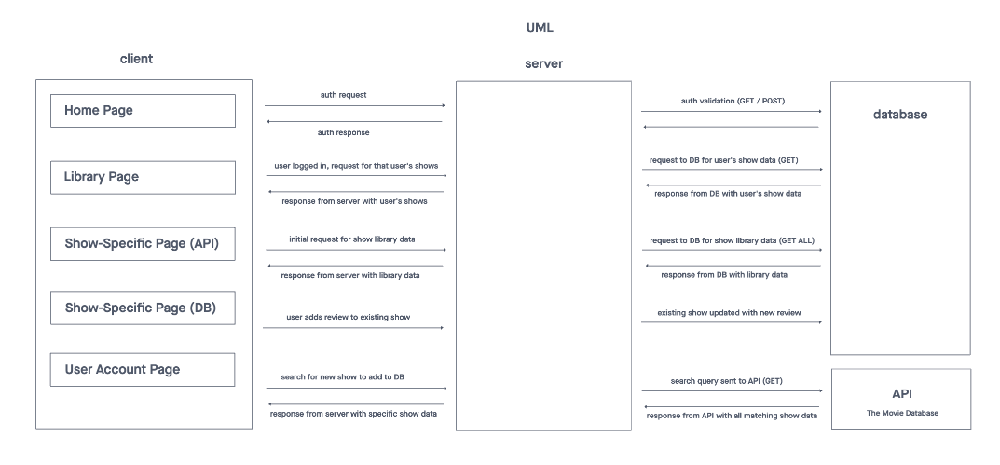

# The Binge - A TV Review App

## Back End Documentation

## Authors

- Guy Farley
- Elizabeth Hammes
- Katharine Swilley

## Problem Domain

With all the TV shows currently available, it's increasingly difficult to choose your next show. What if there was a site where you could go to see personal recommendations from other users who have watched and reviewed TV shows? This avoids relying on recommendations from streaming services (who are only pushing their own shows) or critical review sites (Iike Rotten Tomatoes), and helps you to find shows that you will actually enjoy watching.

## Project Overview

**Introducing "The Binge", a more personal TV review app**

The Binge allows a user to:

- Create an account, and login
- View shows and recommendations for shows other users have watched and reviewed
- Add a new show to the database (by searching a 3rd party API)
- Select a title to view additional info and all reviews
- Visit their personal library page to see shows they have reviewed

*Technologies used:*

- Frontend: React, Redux, Material UI
- Backend: Postgres, SQL/Sequelize, Axios, Express
- Project Management: Invision, GitHub

## How to Run This Application

Application is deployed here:

<https://cf-tv-review-app.herokuapp.com/user>

<https://cf-tv-review-app.herokuapp.com/show>

<https://cf-tv-review-app.herokuapp.com/review>

## Features & User Stories

**As a user, I want to be able to leave a review for a TV Show so that I can share my feedback and add the show to my Show List in my Account**

*Description:*

- View show specific page, populated from database
- Add a review via review button
- Adds TV Show to user's profile

*Acceptance Criteria:*

- A user can view a show specific page (show title, image, description, and reviews)
- A user can write a review for the show
- Show is added to user's account when they leave a review

**As a user, I want to be able to search for a TV Show that doesn’t exist in the library so that I can access the data available for the show I’ve watched**

*Description:*

- Add CTA button to library page that allows a user to add a tv show to library
- Create search modal to search for TV Show
- Show search results: Title, image, CTA button (linked to show specific page based on API data)
- View show specific page, populated with API data
- Add a review via review button
- POST request, creating record of TV Show and record in db and adds TV Show to user's profile

*Acceptance Criteria:*

- A user can choose to add a TV show to the library
- A user can search TV Shows against the Movie Database API (20 max search results)
- A user can view the show specific page
- A user can leave the first review for the TV Show
- The TV show is added to the database after the first review is added
- The TV show is added to the user's account

**As a user, I want to be able to browse a library of TV shows that have been reviewed by other users to help me decide what to watch next**

*Description:*

- Create library page
- Display list of tv shows (from db): title, image, CTA
- Add Library link to navigation

*Acceptance Criteria:*

- Any user can view the library page of tv shows and click the CTA button to view additional show details, including reviews left by other users
- A user can navigate to the Library page by using the navigation bar

**As a user, I want to be able to log in to my account to access all capabilities the site has to offer**

*Description:*

- Add Login / Logout to Nav
- Enable/Disable features based on logged in status

*Acceptance Criteria:*

- A user can login to their account using their email and password credentials
- A user can logout of their account
- A user has access to additional features when logged into their account: add TV shows to their account, leave reviews, add Shows to library

**As a user I want to sign up (create an account) to use Good Shows (name TBD) so that I can share what shows I like with others**

*Description:*

- Add Create Account to Nav
- Create account modal: username, password

*Acceptance Criteria:*

- A user can create an account with a unique email address and a password

## Visual Documentation

### Wireframe

### SQL Database Schema

### Web Request/Response Cycle

## Links and Resources

<https://developers.themoviedb.org/3/getting-started/introduction>

<https://react-redux.js.org/>

<https://www.npmjs.com/package/axios>

<https://reactjs.org/>

<https://mui.com/>
